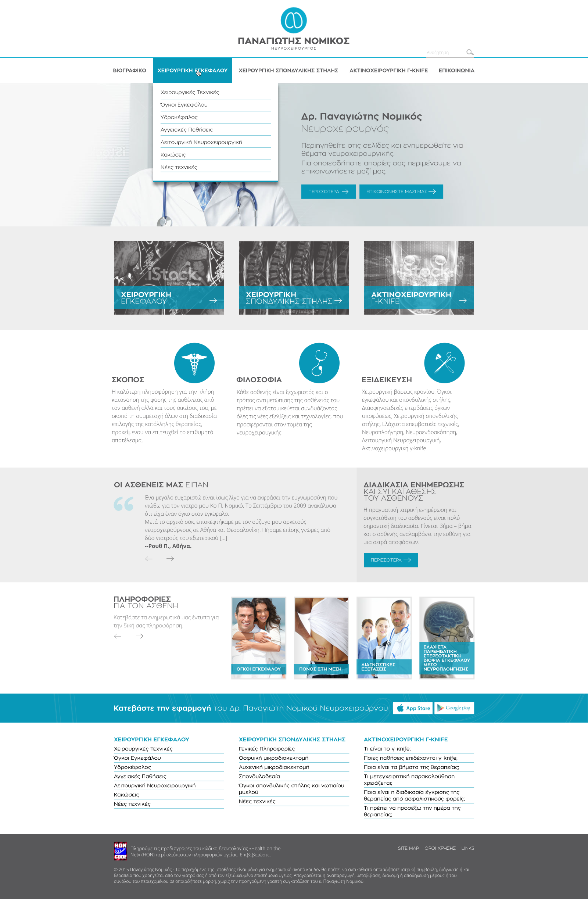

# 🎨 Figma to Website Project

## 📖 Περιγραφή
Σε αυτό το project του προγράμματος CodeArena, μετέτρεψα ένα **Figma design** σε πλήρως λειτουργική ιστοσελίδα.  
Χρησιμοποίησα **HTML** για τη δομή, **Tailwind CSS** για το responsive styling και **JavaScript** για τη λειτουργικότητα των μενού (mobile navigation, dropdowns).  

Το αποτέλεσμα είναι ένα **responsive και ελαφρύ website** που αποδίδει πιστά το αρχικό design.  

---

## 🎨 Figma Design
Ακολουθεί ένα στιγμιότυπο από το αρχικό design στο Figma:  

👉 [Δείτε το αρχικό design στο Figma] (https://www.figma.com/design/InDP3E4UiOlVpkK3CpgBCm/CodearenaDesignEdit?node-id=0-1&p=f&t=PXGbgPZt6EQSIlW9-0)  

---

## 🔗 Live Preview
[Δείτε το site εδώ](https://jeanne9999.github.io/figma-site/)

---

## ⚙️ Τεχνολογίες
- **HTML5**  
- **Tailwind CSS**  
- **JavaScript**  

---
